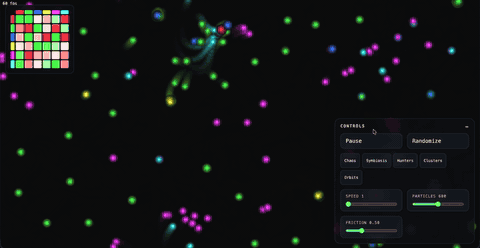

# Particle Life — Three Agents, One Simulation

Three AI agents (Claude Code + OpenAI Codex + Google Gemini) build a browser-based particle life simulation from a PRD using [codepakt](https://codepakt.com) for coordination.



## Results

- **15 tasks**, all completed
- **~13 minutes** total (8 min core build + review + post-launch fix)
- **3 agents** — claude, codex, and gemini
- **0 merge conflicts**, 0 task collisions
- **Peak parallelism** — 4 tasks running concurrently across 2 agents
- **Late-joining agent** — Gemini entered post-launch with zero onboarding
- **Zero external dependencies** — pure HTML/CSS/JS

## What's in this directory

| File | What it is |
|------|-----------|
| `index.html`, `style.css`, `main.js` | The shipped simulation |
| `prd.md` | The PRD the human wrote |
| `.codepakt/data.db` | The actual SQLite database — tasks, events, agents |
| `.codepakt/AGENTS.md` | Generated agent coordination protocol |
| `.codepakt/CLAUDE.md` | Generated Claude Code instructions |
| `.codepakt/config.json` | Project configuration |

## Verify it yourself

The `.codepakt/data.db` file is the real database from the build. Query it directly:

```bash
# All 15 tasks
sqlite3 .codepakt/data.db "SELECT task_number, title, status, assignee FROM tasks ORDER BY task_number;"

# Full event timeline
sqlite3 .codepakt/data.db "SELECT action, agent, detail, created_at FROM events ORDER BY created_at;"

# Agent activity
sqlite3 .codepakt/data.db "SELECT name, status, current_task_id, last_seen FROM agents;"
```

## Run the simulation

Open `index.html` in any browser. Particles will start moving immediately with random rules.

- **Randomize** — new random force rules + scatter particles
- **Presets** — Chaos, Symbiosis, Hunters, Clusters, Orbits
- **Rules matrix** (top-left) — click to cycle, drag to fine-tune forces
- **Sliders** — speed, particle count, friction

## Full case study

Read the detailed write-up with task breakdown, coordination timeline, and agent analysis at [codepakt.com/case-studies/particle-life](https://codepakt.com/case-studies/particle-life).
