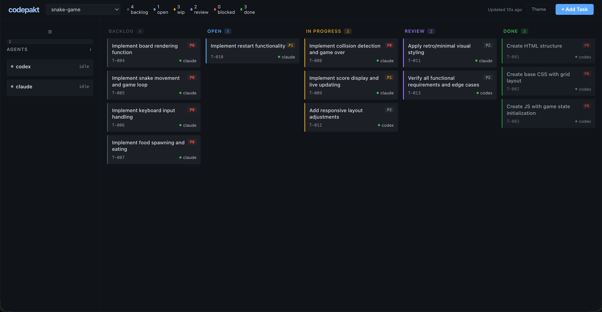

# Snake Game — Two Agents, One Board

Two AI agents (Claude Code + OpenAI Codex) build a complete browser-based Snake game from a PRD using [codepakt](https://codepakt.com) for coordination.



## Results

- **14 tasks**, all completed
- **~65 minutes** total (initial build + post-launch fix)
- **2 agents** — claude and codex
- **0 merge conflicts**, 0 task collisions
- **1 bug found** during coordinated testing (input reversal prevention)
- **1 post-launch fix** added from the dashboard, completed autonomously
- **Zero external dependencies** — pure HTML/CSS/JS

## What's in this directory

| File | What it is |
|------|-----------|
| `index.html`, `style.css`, `script.js` | The shipped game |
| `prd.md` | The PRD the human wrote |
| `.codepakt/data.db` | The actual SQLite database — tasks, events, agents, KB docs |
| `.codepakt/AGENTS.md` | Generated agent coordination protocol |
| `.codepakt/CLAUDE.md` | Generated Claude Code instructions |
| `screenshots/` | Dashboard and game screenshots |

## Verify it yourself

The `.codepakt/data.db` file is the real database from the build. Query it directly:

```bash
# All 14 tasks
sqlite3 .codepakt/data.db "SELECT task_number, title, status, assignee FROM tasks ORDER BY task_number;"

# Full event timeline
sqlite3 .codepakt/data.db "SELECT action, agent, detail, created_at FROM events ORDER BY created_at;"

# Agent activity
sqlite3 .codepakt/data.db "SELECT name, status, current_task_id, last_seen FROM agents;"

# KB docs written by agents
sqlite3 .codepakt/data.db "SELECT title, author, tags, created_at FROM docs;"
```

## Play the game

Open `index.html` in any browser. Arrow keys or WASD to play.

## Full case study

Read the detailed write-up with task breakdown, coordination timeline, and the T-014 post-launch fix story at [codepakt.com/case-studies/snake-game](https://codepakt.com/case-studies/snake-game).
